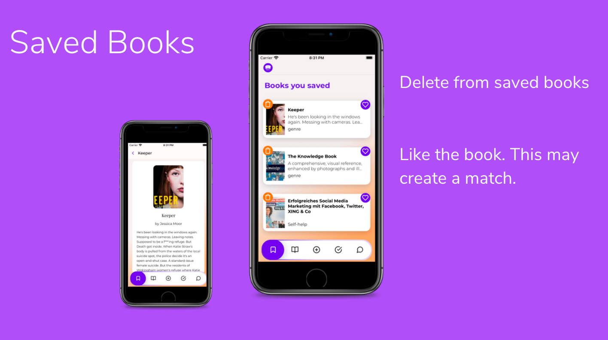

# librix: Frontend

librix is a book-swapping mobile app. This is the frontend part built with React Native on Expo. You can find [our RESTful backend here](https://github.com/Final-Project-X/librix-server).

## Table of Contents

- [librix: Frontend](#librix-frontend)
  - [Table of Contents](#table-of-contents)
  - [About the app](#about-the-app)
    - [Screenshots](#screenshots)
    - [Features](#features)
  - [Running locally](#running-locally)
  - [Technologies](#technologies)
  - [Collaboration](#collaboration)
  - [Upcoming features](#upcoming-features)
  - [Credits](#credits)

## About the app

Exchange books you don't need anymore for the ones you would love to read.

Add a book and start swiping the books in the pool of books!

- Swipe left: not interested
- Swipe right: interested in swapping
- Swipe down: save for later

If you swipe a book right, and its owner liked one of your books — there is a match!

Once the match is created, you can:

- chat with your match partner,
- reserve your book for this match,
- delete the match,
- confirm that the exchange was successful

### Screenshots

### Features

1. Secure login / registration
2. Managing a personal profile
3. Adding books for exchange with images
4. Navigating the pool of books via swiping
5. Filtering the pool of books by language, genre, and location
6. Saving books for later
7. Creating a match with another user and:
   1. reserving/accepting the match
   2. deleting/declining the match
   3. completing the exchange
8. Viewing match partner's profile

## Running locally

Requirements:

- Node & NPM
- [Expo CLI](https://docs.expo.io/workflow/expo-cli/)
- Expo Go mobile app or iOS Simulator and/or Android emulator

Steps:

1. clone the repo: `git clone git@github.com:Final-Project-X/librix-client.git`
2. cd into `librix-client` directory
3. run `npm install` to get all the dependencies
4. run `npm start` to start the Metro server — this will open a window in your browser with further instructions

## Technologies

1. React Native
2. React Navigation
3. Redux (React Redux, Thunk)
4. Axios
5. Google Books API
6. a number of 3rd-party libraries

## Collaboration

Tools the librix team used to plan, develop, and collaborate:

- Whimsical
- Jira
- Figma
- Canva
- Slack & Zoom

Most of the time, every team member chose a feature and worked on it on a separate branch. Then, a pull request was created, and other team members reviewed and merged the branch. For the critical functionality (e.g. setting up Redux or the project structure), we did group programming via Live Share extension in VSCode.

## Upcoming features

1. Real-life chat
2. Deleting books
3. Adding and changing avatars
4. Adding multiple photos for a single book
5. Social login

## Credits

The librix team includes:

- [Christin Mette](https://github.com/chmette), Backend
- [Joyce Sosaya](https://github.com/Winkel2019), Frontend
- [Laura de Paz](https://github.com/laurapacis), Frontend
- [Luke Dowling](https://github.com/luke-dowling), Backend
- [Olha Halat](https://github.com/olhanotolga), Frontend
- [Tomas Eliz](https://github.com/TomasEliz), Frontend
